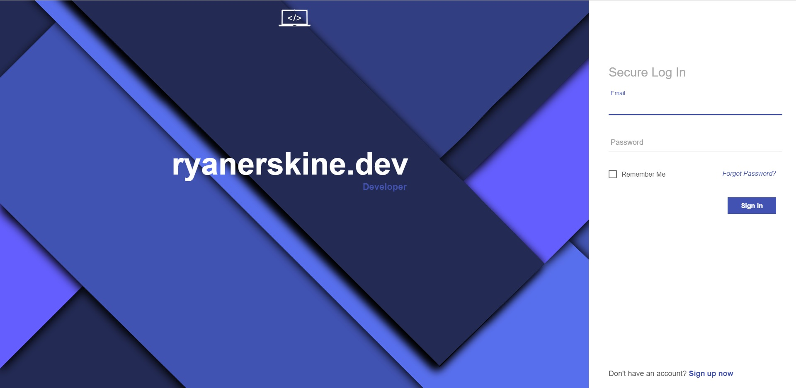

# auth0-custom
Examples of custom pages for Auth0. Clone this repo with

```
git clone https://github.com/ryanjerskine/auth0-custom.git
```

## Login
A better looking Auth0 login page. Using the login page is as simple as copying the HTML found [here](login/dist/index.html) to your
Auth0 page. If you want to keep the same background image, you will also need the [svg](login/dist/background.svg). Here is what the
login page looks like without any modification:

